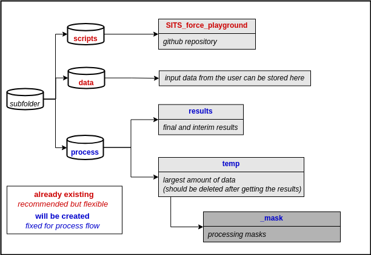

# SITS Basemap WMS

This repository builds Sentinel-2 basemap layers with the [FORCE Time Series Framework](https://force-eo.readthedocs.io/en/latest/index.html).

The workflow has two goals:
- extract cloud-robust Sentinel-2 composites with FORCE
- convert those raw outputs into RGB and CIR GeoTIFFs that are easier to use as WMS basemap layers

The repository is focused on batch production. Instead of running one script to prepare FORCE and another script to clean and export the images tile by tile, the main workflow now runs from a single entry point.

## What The Repository Does

The processing chain is:

1. prepare a FORCE project for one or more AOIs
2. create the required mask, tile extent, and parameter files
3. run a UDF or standard TSA workflow in FORCE
4. collect the raw FORCE output tiles
5. clip each intersecting FORCE tile to the AOI and write compressed raw tile outputs
6. apply a shared radiometric stretch across the clipped tiles
7. export WMS-ready products such as RGB or CIR
8. build a GDAL VRT mosaic and optionally a final GeoTIFF mosaic

For the default UDF workflow, the repository uses `utils/skel/udf_rgb_p25_least_cloudy_block.py`. That UDF keeps the least cloudy observations and writes percentile-based RED, GREEN, BLUE, NIR, and valid-scene outputs that are later converted to display-ready imagery and FORCE 3.9.02.

## Main Files

- `force_wms.py`: main entry point for prepare, run, render, and mosaic steps
- `build_wms_rgb.py`: compatibility wrapper that forwards to `force_wms.py`
- `utils/force_class_utils.py`: creates FORCE project structure and parameter files
- `utils/wms_rgb.py`: renders FORCE output tiles into WMS-ready RGB/CIR GeoTIFFs and mosaics
- `utils/skel/udf_rgb_p25_least_cloudy_block.py`: default UDF for cloud-robust basemap composites

## Requirements

The code is designed for Ubuntu-style environments and expects:

- Python 3.9
- FORCE 3.9.02-dev or a compatible Docker image
- Docker access for running FORCE commands
- `gdal-bin` for clipping, VRT build, and final GeoTIFF export
- `xterm` for the current execution flow

Setup example:

```bash
conda create --name sits_basemap python==3.9
conda activate sits_basemap
cd /path/to/SITS_basemap_wms
pip install -r requirements.txt
sudo apt-get install xterm gdal-bin
```

If FORCE is not installed locally, use the official Docker workflow:
- https://force-eo.readthedocs.io/en/latest/setup/docker.html#docker

## Repository Structure

The workflow uses the FORCE-style process directory layout under the chosen `base_path`:

- `process/temp/<project_name>/FORCE/<aoi>/`
- `process/temp/_mask/<project_name>/<aoi>/`
- `process/results/`
- `process/data/`

The helper image below illustrates the expected structure:



## Running The Workflow

The main script is `force_wms.py`.

Example:

```bash
python force_wms.py \
  --project-name zGermany_full_tiles \
  --aoi "/rvt_mount/3DTests/data/harm_data/shp_germany_border.shp" \
  --workflow udf \
  --udf-source utils/skel/udf_rgb_p25_least_cloudy_block.py \
  --product rgb \
  --product cir
```

This command:
- resolves the AOI path or glob
- prepares FORCE parameter files
- runs FORCE for each AOI
- finds all raw output tiles in `tiles_tss`
- clips intersecting raw tiles to the AOI
- exports WMS-ready `rgb` and `cir` tile products
- writes VRT mosaics and can optionally materialize final GeoTIFF mosaics

## Useful Options

- `--skip-prepare`: reuse existing FORCE parameter files
- `--skip-force`: skip FORCE execution and only render from existing raw tiles
- `--skip-render`: stop after FORCE preparation and execution
- `--skip-clip`: reuse already clipped raw FORCE tiles from a previous run
- `--skip-vrt`: export tile products without building the VRT mosaic
- `--skip-final-raster`: keep the VRT and tile products but do not materialize the final GeoTIFF mosaic
- `--overwrite-tiles`: rebuild clipped and rendered tile outputs
- `--no-overviews`: disable overview creation on rendered outputs
- `--workflow tsa`: use the standard TSA parameter generation instead of the UDF workflow
- `--min-valid-scenes`: require a minimum number of valid scenes per pixel
- `--low-pct` and `--high-pct`: control the global stretch used for WMS export
- `--product rgb` or `--product cir`: choose the rendered display products
- `--compression-method`, `--bigtiff`, `--zlevel`, `--blocksize`: control GeoTIFF storage for large runs
- `--num-threads` and `--cachemax-mb`: tune GDAL clipping performance

## Outputs

The rendered products are written under `process/results/<project_name>/` and can include:

- clipped raw FORCE tiles for resumable postprocessing
- WMS-ready RGB GeoTIFF tiles
- WMS-ready CIR GeoTIFF tiles
- project-wide VRT mosaics
- optional project-wide GeoTIFF mosaics
- JSON reports for clipping and rendering stages

The rendering step preserves an alpha band and valid-scene information so the outputs are easier to use in map services and downstream quality control.

## Notes

- AOI shapefiles are reprojected to EPSG:3035 when needed.
- FORCE paths and mount points are currently configured through CLI arguments such as `--base-path`, `--local-dir`, and `--force-dir`.
- For Germany-scale production, the workflow writes both the VRT and the final GeoTIFF mosaic by default. Use `--skip-final-raster` only when you explicitly want VRT-only delivery.
- Always inspect generated `.prm` files before launching large production runs.

## Versioning

This repository targets FORCE `3.9.02-dev:::2025-10-16`.

## Authors

- [Sebastian Valencia](https://github.com/Azarozo19)

## License

This project is licensed under the GNU General Public License v3. See `LICENSE`.

## Acknowledgments

- FORCE Framework by David Frantz: https://force-eo.readthedocs.io/en/latest/index.html
- Time Series Classification work by Marc Russwurm: https://github.com/MarcCoru
